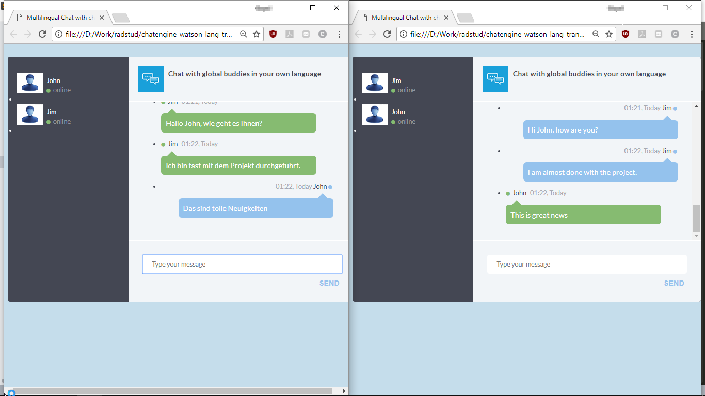

Setting up backend for multilingual chat app using PubNub ChatEngine involves two major steps:

1. Setup Watson Translator Service
2. Setup PubNub account with ChatEngine support

This file provides detailed steps to carry out the frontend setup for multilingual chatbot using PubNub ChatEngine and IBM Watson Language Translator service.

#### Prerequisites

Before you can create Watson Language Translator Service, you need your own [IBM ID](https://console.bluemix.net/).  

You also need a developer account on [PubNub](https://admin.pubnub.com) to  create and configure PubNub function for accessing Watson Language Translator service. Once you have created the accounts, follow the steps below.

### Configure PubNub ChatEngine

The PubNub microservice and Watson Language translator service are setup already if you followed the backend setup from file [setup-backend.md](setup-backend.md). The next and final steps are to run the chat app locally and talk to your buddies from across the globe in your own language.

###### Step 1:

* From the cloned GitHub repo on your computer, open the file [chat.js](userapp-en/scripts/chat.js) from the `userapp-en/scripts` folder. Replace the publish, subscribe keys in the file with your own publish, subscribe keys obtained in step 6 of [setup-backend.md](setup-backend.md) file earlier. Save the file when done.

```javascript
pubnub_pub_key = 'YOUR_PUBNUB_PUBLISH_KEY';
pubnub_sub_key = 'YOUR_PUBNUB_SUBSCRIBE_KEY'
```

###### Step 2:

* Similar to step 13, put your PubNub publish, subscribe keys in the [chat.js](userapp-de/scripts/chat.js) file from `userapp-de/scripts` folder as well and save the file.

```javascript
pubnub_pub_key = 'YOUR_PUBNUB_PUBLISH_KEY';
pubnub_sub_key = 'YOUR_PUBNUB_SUBSCRIBE_KEY'
```

###### Step 3:
Now open the file [index.html](userapp-de/index.html) from folder `userapp-de` in a browser window and then in another browser open the file [index.html](userapp-en/chat.html) from `userapp-en` folder.

You can see that chat windows show two users online.




 You can start chatting in English from the index.html file opened from `userapp-en` folder. The other chat window should now show the same messages in German language. You can also try keying in some messages in German language from the index.html opened from `userapp-de` folder and you should see corresponding translated English messages in the other browser window.

 You are done!
